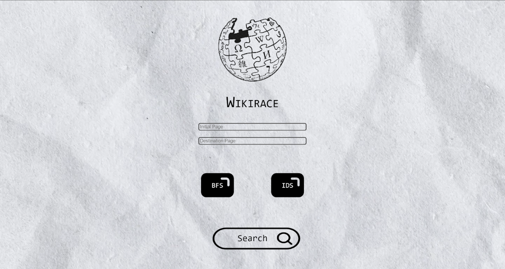

# Tubes Stima 2 by GasTubes
> WikiRace Game Solver written in Go. Based on the concept of Breadth First Search (BFS) and Iterative Deepening Search (IDS) algorithm.

## Table of Contents
* [General Information](#general-information)
* [IDS and BFS Implementation](#ids-and-bfs-implementation)
* [Technologies Used](#technologies-used)
* [Features](#features)
* [Overview](#overview)
* [Setup](#setup)
* [Project Status](#project-status)
* [Room for Improvement](#room-for-improvement)
* [Library](#library)
* [Acknowledgements](#acknowledgements)
* [Authors](#authors)

## General Information

WikiRace or Wiki Game is a game involving Wikipedia, a free online encyclopedia maintained by various volunteers around the world, where players start at a Wikipedia article and have to browse other articles on Wikipedia (by clicking on the link within each article) to go to another article that has been predetermined in the shortest time or fewest clicks (articles).

The program is made to solve the WikiRace Game problem and to win the game by implementing the IDS and BFS algorithm. It is a web-based application which receives input in the form of algorithm type, initial article title, and title purpose article. The program provides output in the form of the number of articles examined, the number of articles traversed, the article browsing route (from the initial article to the destination article), and search time (in ms).

## IDS and BFS Implementation 
### BFS
In the BFS algorithm, a queue is used whose elements are an array of strings that represent the routes that have been traced so far. The function is called recursively with each new call representing greater depth. The way the algorithm works is by looking at all queue elements and checking only the last link. The link is then selected for expansion if it has not been expanded previously and a check is carried out for all links resulting from the expansion. If the link has been found, the program returns the route, but if not, it will be added to the string array containing the previous link and added to the queue. The queue is then used for the next recursion until we get the answer.

_(Dalam algoritma BFS digunakan sebuah antrian yang elemennya berupa array of string yang melambangkan rute yang sejauh ini sudah ditelusuri. Fungsi dipanggil secara rekursif dengan setiap pemanggilan baru merepresentasikan kedalaman yang lebih besar. Cara kerja algoritmanya dengan melihat semua elemen queue dan mengecek tautan terakhir saja. Tautan tersebut kemudian dipilih untuk diekspansi jika belum diekspansi sebelumnya dan dilakukan pengecekan untuk semua tautan hasil ekspansi. Jika tautan sudah ditemukan, program mengembalikan rutenya, tetapi jika belum akan ditambah pada string array yang mengandung tautan sebelumnya dan ditambahkan pada queuenya. Queue tersebut kemudian digunakan untuk rekursi berikutnya sampai mendapatkan jawabannya.)_

### IDS
The IDS algorithm uses string array parameters as route records and uses the DLS principle. Similar to BFS, the last link of the array will be checked and expanded if it has not been done before. For each link the expansion results will be added to the route and call the next level DLS. The depth of the DLS will be recorded in the parameters and called by the IDS as a depth controller according to the IDS concept. The program will stop and return results if the searched link matches the desired one.

_(Algoritma IDS menggunakan parameter string array sebagai pencatatan rute dan menggunakan prinsip DLS. Serupa dengan BFS, tautan terakhir dari array yang akan dicek sifatnya dan diekspansi jika belum sebelumnya. Untuk setiap tautan hasil ekspansi akan ditambahkan pada rutenya dan memanggil DLS tingkat berikutnya. Kedalaman dari DLS akan dicatat pada parameter dan dipanggil oleh IDS sebagai pengendali kedalamannya sesuai konsep IDS. Program akan berhenti dan mengembalikan hasil jika tautan yang ditelusuri sudah sesuai dengan yang diinginkan.)_

## Technologies Used
The whole program was written in Go.

## Features
- [x] Receive input in the form of algorithm type, initial article title, and title purpose article
- [x] Choose the algorithm (IDS or BFS) through input from the user
- [x] Provides output in the form of the number of articles examined, the number of articles traversed, the article browsing route (from the initial article to the destination article), and search time (in ms)
- [x] Can at least issue one of the shortest routes that is less than 5 minutes in each game
- [x] **Bonus Feature**: Find the shortest route with a duration of less than one minute
- [x] **Bonus Feature**: Can be run using Docker for both frontend and backend

## Overview

## Setup
### Installation
- Download and install [Go](https://go.dev/doc/install) 
- Install the whole modules and libraries used in the source code
- Download the whole folders and files in this repository or do clone the repository

### Compilation 
To run in local:

Frontend
1. Clone this repository in your own local directory

    `git clone https://github.com/ZachS17/Tubes2_GasTubes.git`

2. Open the command line and change the directory to 'Frontend' folder

    `cd Tubes2_GasTubes/src/Frontend`
    
3. Run `npm install` on the command line
4. Run `npm run start` on the command line

Backend 
1. Navigate to `/src/Backend` folder
2. Run `go get .` to make sure all dependencies installed
3. Run `go run api.go`
4. **Recommended**: test the API using [Postman](https://www.postman.com/downloads/) or thunder client on vscode extensions

## Project Status
Project is: _complete_

All the specifications were implemented.

## Room for Improvement
- A faster or more efficient algorithm to make the program run quicker
- A better UI/UX to satisfy the users of this application

## Library
* [React](https://reactjs.org/)
* [Golang](https://go.dev/)
* [Encoding](https://pkg.go.dev/encoding)
* [Log](https://pkg.go.dev/log)
* [Net](https://pkg.go.dev/net)
* [Os](https://pkg.go.dev/os)
* [Strings](https://pkg.go.dev/strings)
* [Sync](https://pkg.go.dev/sync)
* [Math](https://pkg.go.dev/math)
* [Time](https://pkg.go.dev/time)
* [Fmt](https://pkg.go.dev/fmt)

For testing purposes:
* [Postman](https://www.postman.com/downloads/)

  
## Acknowledgements
- This project was based on [Spesifikasi Tugas Besar 2 Stima](https://informatika.stei.itb.ac.id/~rinaldi.munir/Stmik/2023-2024/Tubes2-Stima-2024.pdf)
- Thanks to God
- Thanks to Mrs. Masayu Leylia Khodra, Mrs. Nur Ulfa Maulidevi, and Mr. Rinaldi as our lecturers
- Thanks to academic assistants
- This project was created to fulfill our Big Project for IF2211 Algorithm Strategies

## Authors
| No. | Name | Student ID |
| :---: | :---: | :---: |
| 1. | Habibi Galang Trianda | 10023457 |
| 2. | Nelsen Putra | 13520130 |
| 3. | Zachary Samuel Tobing | 13522016 |
